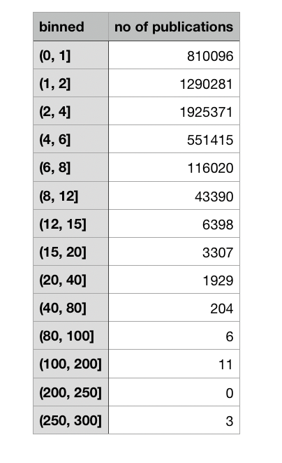
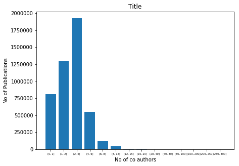

##   Overview

This project is aimed at parallel processing of the publically available [DBLP](https://dblp.uni-trier.de/) dataset which is sort of Computer Science Bibliography which contains details about authors, their various publication, venues etc. 
Each entry in the dataset describes a publication, which holds the list of authors,title, publication venues, publication year and a few more attributes. This file is almost 2.5 GB, which gets updated on a regular basis. This dataset size is not too big for today's standard but still involves quite a  lot of processing. Each entry is independeent from the other one in that it can be processed without synchronizing with processing some other entries. 

Consider the following entry in the dataset.
```xml
<inproceedings mdate="2017-05-24" key="conf/icst/GrechanikHB13">
<author>Mark Grechanik</author>
<author>B. M. Mainul Hossain</author>
<author>Ugo Buy</author>
<title>Testing Database-Centric Applications for Causes of Database Deadlocks.</title>
<pages>174-183</pages>
<year>2013</year>
<booktitle>ICST</booktitle>
<ee>https://doi.org/10.1109/ICST.2013.19</ee>
<ee>http://doi.ieeecomputersociety.org/10.1109/ICST.2013.19</ee>
<crossref>conf/icst/2013</crossref>
<url>db/conf/icst/icst2013.html#GrechanikHB13</url>
</inproceedings>
```

This entry lists a paper at the IEEE International Conference on Software Testing, Verification and Validation (ICST) published in 2013. The presence of three co-authors in a single publication like this one increments a count variable that represents the number of publications with three co-authors.My job here is to determine the distribution of the number of authors across many different journals and conferences using the information extracted from this dataset. Paritioning this dataset into shards is easy, since it requires to preserve the well-formedness of XML only. 

## Functionality
The project aims to create a program using the map/reduce model for parallel processing of the publication dataset. My goal is to produce various statistics about the numbers of co-authors. One such statistics is expressed as a histogram where each bin shows the range of the numbers of co-authors (e.g., the first bin is one, second bin is 2-3, third is 4-6, and so on until the max number of co-authors). The other statistics will produce the histogtram stratified by journals, conferences, and years of publications. Next, I will produce the list of top 100 authors in the descending order who publish with most co-authors and the list of 100 authors who publish with least co-authors. 

To compute the authorship score, the following formula is used. The total score for a paper is one. Hence, if an author published 15 papers as the single author without any co-authors, then her score will be 15. For a paper with multiple co-authors the score will be computed using a split weight as the following. First, each co-author receives 1/N score where N is the number of co-authors. Then, the score of the last co-author is credited 1/(4*N) leaving it 3*N/4 of the original score. The next co-author to the left is debited 1/(4*N) and the process repeats until the first author is reached. For example, for a single author the score is one. For two authors, the original score is 0.5. Then, for the last author the score is updated 0.5*3/4 = 0.5-0.125 = 0.375 and the first author's score is 0.5+0.125 = 0.625. The process repeats the same way for N co-authors.

Finally, I will output a spreadsheet where for each author you will compute the max, median, and the average number of authors for publication on which the name of the author appears. Also,  a stratified breakdown of these statistics by publication venues in addition to the cumulative statistics across all venues. My job is to create the mapper and the reducer for this task, explain how they work, and then to implement them and run on the DBLP dataset. The output of my map/reduce is a spreadsheet or a CSV file with the required statistics.

After creating and testing this map/reduce program locally, The job was deployed and run on the Amazon Elastic MapReduce (EMR).

## Steps to run on VM:

- Setup sbt on your system
- Add the assembly plugin to it(you can find all the steps if you google sbt assembly)
- Run `sbt clean assembly` , which will run the test cases and run generate the fat JAR
- Copy the jar on the virtual machine which should have Java 1.8 .
    - to send the jar from your host to VM, you can use 
        - ``scp mayank_raj_hw2-assembly-0.1.jar username@IPAddressofVM:DestinationDirectory``
        - for Cloudera QuickStart VM , the default username and password is cloudera
- Make sure to create the input_file directory in HDFS and put dblp.xml in that folder 
    - ``hadoop fs -mkdir /user/username/inputdirectoryname``
    - ``hadoop fs -put dblp.xml /user/cloudera/inputdirectoryname``
- Run the command 
```
hadoop jar mayank_raj_hw2-assembly-0.1.jar mayankraj.hw2.MainDriver.MainDriver path/to/input/file path/to/output/file
```

## Running the jar on Amazon EMR

- Refer to the the youtub link shared to see all the steps involved in deploying the jobs on the cloud
[Link to youtube video](https://youtu.be/tz73Tq3i6w8)

## Implementation

-I have implemented a custom input format which implements recordReader which generates key,values for multiple start tags and end tags

Start Tags 
```
<article ,<inproceedings ,<proceedings ,<book ,<incollection ,<phdthesis ,<mastersthesis ,<year ,<journal
```

End Tags
```
</article>,</inproceedings>,</proceedings>,</book>,</incollection>,</phdthesis>,</mastersthesis>,</year>,</journal>
```

- **The _Mapper_ :**
-  There are multiple mappers that I have implemented based on jobs that are running
- For instance, the job for calculating the authorship scores, implements a mapper which calculates the authorship score of all the authors in that individual publication and hence create key,value pair of (Name of the Author, Score for that Publication)
- Emits the author name and its authorship score for that publication
- Another mapper is for counting the number of coauthors for the dblp dataset. It counts the number of coauthors in a publication and emits the number of coauthors as key and 1 as value
- There are other mappers as well which implement the rest of the jobs

_For example:_
suppose there are 2 authors of a paper then the mapper for authorship score job emits:
   
   (author1, 0.625), (author2, 0.375)

- **The _Reducer_ :**

- The combiner and reducer usually are adding all the corresponding values of the keys, thereby summing up all the number of  values emitted by the mapper 
- These output values are then written into output files


[]
[]

I have done stastical analysis of the output filesby  using python script which reads the entire outputs for different jobs. It then creates .csv files from them and then the several analysis on that data is done which includes bar charts, max-median-mean for some outputs etc.
